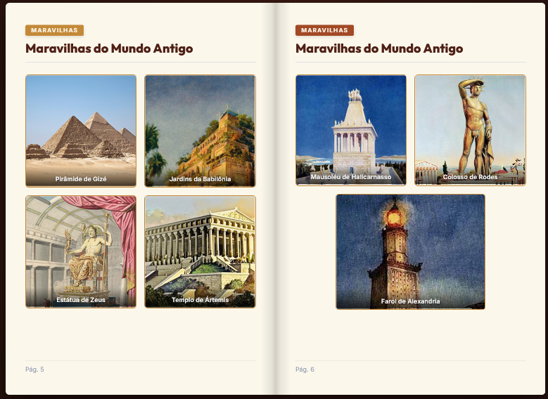
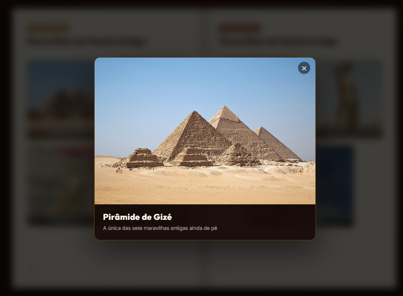

# 🏛️ Álbum Histórico - Civilizações da Antiguidade

> Projeto desenvolvido durante a **Imersão IA da Alura**, combinando Inteligência Artificial, desenvolvimento Web e experiência do usuário em uma relíquia digital interativa.

[](https://www.python.org/)
[](https://fastapi.tiangolo.com/)
[](https://developer.mozilla.org/pt-BR/docs/Web/HTML)
[](https://developer.mozilla.org/pt-BR/docs/Web/CSS)
[](https://developer.mozilla.org/pt-BR/docs/Web/JavaScript)
---

## 📌 Sobre o Projeto

O **Álbum Histórico** é uma aplicação web interativa que funciona como um álbum de figurinhas digital, exibindo figuras e monumentos marcantes da História Antiga (Mesopotâmia, Egito Antigo, Grécia Antiga, Roma Antiga e as Maravilhas do Mundo Antigo).

### ✨ Funcionalidades Principais
* 📖 **Simulação Física de Livro 3D:** Experiência imersiva de folhear páginas utilizando a biblioteca `St.PageFlip`.
* 🔊 **Áudio Procedural:** Efeitos sonoros reais de papel sendo folheado gerados em tempo real via **Web Audio API** (sem dependência de arquivos MP3 pesados).
* 🖼️ **Carregamento Dinâmico de Figurinhas:** Consumo de dados e imagens via API REST integrada construída em FastAPI.
* 🎨 **Design Temático Clássico:** Interface elegante com tons terracota, ouro antigo e pergaminho, com animações e efeitos visuais.

---

## 🖼️ Demonstração do Projeto




---

## 🛠️ Tecnologias Utilizadas

- **Backend:** Python 3, FastAPI, Uvicorn, CORS Middleware.
- **Frontend:** HTML5 Semântico, CSS3 (Vanilla), JavaScript (ES6+).
- **Bibliotecas & APIs:** Page-Flip (`St.PageFlip`), Web Audio API, Fetch API.

---

## 📂 Estrutura do Repositório

```
imersao-desenvolvimento-ia-alura/
├── backend/
│   ├── figurinhas/          # Imagens das figurinhas históricas
│   └── main.py              # API FastAPI com os endpoints REST
├── frontend/
│   ├── index.html           # Estrutura HTML do álbum
│   ├── style.css            # Estilização e animações
│   ├── app.js               # Lógica de consumo da API, PageFlip e áudio
│   └── cover-art.png        # Arte da capa do álbum
└── README.md                # Documentação do repositório
```

---

## 🚀 Como Executar o Projeto

### Pré-requisitos
* **Python 3.8+** instalado.

---

### 1. Executando o Backend (API FastAPI)

1. Navegue até a pasta `backend`:
   ```bash
   cd backend
   ```

2. (Opcional) Crie e ative um ambiente virtual Python:
   * **Windows:**
     ```powershell
     python -m venv venv
     .\venv\Scripts\activate
     ```
   * **Linux/macOS:**
     ```bash
     python3 -m venv venv
     source venv/bin/activate
     ```

3. Instale as dependências necessárias:
   ```bash
   pip install fastapi uvicorn
   ```

4. Execute o servidor da API:
   ```bash
   uvicorn main:app --reload
   ```
   > A API ficará disponível em `http://localhost:8000`.

---

### 2. Executando o Frontend

1. Com a API rodando, abra o diretório `frontend`.
2. Você pode abrir o arquivo `index.html` utilizando a extensão **Live Server** do VS Code ou através de um servidor HTTP simples em Python:
   ```bash
   cd frontend
   python -m http.server 5500
   ```
3. Abra o navegador e acesse `http://localhost:5500` (ou o endereço gerado pelo Live Server).

---

## 👤 Autor

Desenvolvido por **Rafael Crempe**.

[](https://linkedin.com/in/rafaelcrempe)
